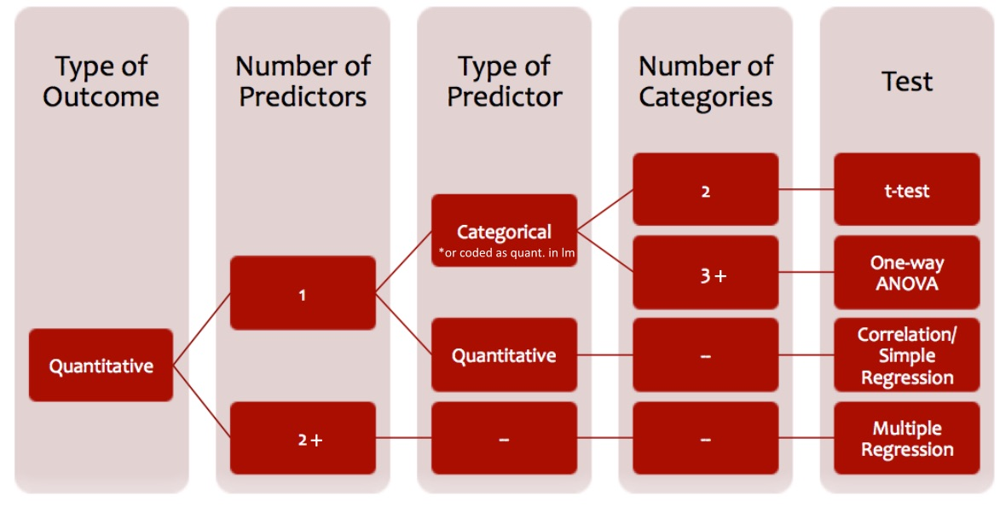

## Preliminaries/review topics

* Questions about homework?

* [Power](http://web.stanford.edu/class/psych252/section/Week2_Section.html#power), and connections to signal detection theory

* [$t$-tests](http://web.stanford.edu/class/psych252/section/Week2_Section.html#t-tests-and-the-null-hypothesis)

* [Centering/Standardizing data](http://web.stanford.edu/class/psych252/section/Week2_Section.html#centering-vs.standardizing-data)

## Which test should I use?

First, think about your dependent variable (DV; the variable that you want to explain or predict). Is it quantitative (i.e. a ```numeric``` type in R) or categorical (i.e. a ```factor``` in R)?

Second, think about the other variables that you might use to explain or predict that DV. How many are there? Are they quantitative or categorical?

The answers to these questions will largely determine the appropriate test to use. Here are some flowcharts to take you through this decision process:

### Flow chart for quantitative DV


### Flow chart for categorical DV


## `lm` bootcamp

`lm` does a lot of magic behind the scenes. To understand what it does, and how to interpret the output, it helps to have a good intuition about regression. There are courses in the statistics department that spend [an entire quarter](http://statweb.stanford.edu/~jtaylo/courses/stats203/) on linear regression models; our goal is to have a working knowledge of regression as it's used in the literature.

### Logic of regression

The goal of regression, loosely speaking, is to understand how a dependent variable changes as a function of independent variables. All the examples of regression we'll talk about in this class are *parametric*, meaning we assume a certain functional form for this relationship (e.g. $y = a + bx$, where $a$ and $b$ are free parameters) and then estimate values for $a$ and $b$ such that our predicted values $y_i$ are as close as possible to the observed values $\hat{y}_i$. We call the distances between $y_i$ and $\hat{y}_i$ the *residuals*. 

`lm` stands for "linear model," and calling `lm(y ~ x)` will find the *line* that minimizes the residuals. [Here's an app](https://gallery.shinyapps.io/simple_regression/
) that lets you play around with a regression line and see the residuals.

Note that `lm` will always find the best possible *line*, but sometimes a line is not the right model for your data. A famous example of this is Anscombe's quarter: four very different datasets that have identical regression lines (and identical correlations!)


The best general practice is to *visualize your data* using `ggplot` before starting to fit models! If the data don't look like a line, then maybe you shouldn't try a linear model. 

Another clue about the appropriateness of the linearity assumption comes from the the distribution of residuals. If there's any kind of structure in them (e.g. if they start mostly below zero, then go above zero), this is a clue that the trend in your data may not be linear.


### Multiple Regression

If you have multiple predictors, you want to know how the dependent variable would change if you wiggled one independent variable while keeping the others fixed. The geometric intuition here gets harder, though. Technically, when you add a variable, you add a dimension, so with two independent variables, you're finding the best *plane* that cuts through the points. This is why adding more independent variables will always reduce the residuals (in the extreme case, consider using one variable per data point, which would use enough dimensions to cut through every observation). This is a typical multiple regression analysis, with a model comparison at the end.

``` {r multiple regression}
d0 = read.csv("http://web.stanford.edu/class/psych252/_downloads/hw2data.csv")

res1a = lm(Futurehapp ~ Pasthapp, data = d0)
summary(res1a)

res1b = lm(Futurehapp ~ Responsible, data = d0)
summary(res1b)

res2 = lm(Futurehapp ~ Pasthapp + Responsible, data = d0)
summary(res2)

anova(res1b, res2)
```

### Colinearity

Note that two or more independent variables in a model may correlate with one another. What will happen if you include two independent variables that are almost identical? (short answer: bad stuff; see [colinearity](https://en.wikipedia.org/wiki/Multicollinearity) on Wikipedia and this [app](https://gallery.shinyapps.io/collinearity/). ) 

``` {r correlations between multiple variables}
d0_corr = data.frame(cbind(d0$Futurehapp, d0$Responsible, d0$Pasthapp))
d0_corr_matrix = cbind(d0$Futurehapp, d0$Responsible, d0$Pasthapp)

colnames(d0_corr) = c("FutureHapp", "Responsible", "PastHapp")
head(d0_corr)

z <- cor(d0_corr)
print(z)

require(lattice)
levelplot(z, panel = panel.levelplot.raster,par.settings=list(regions=list(col=heat.colors(100))))
```

### Transforming variables

Our regression techniques assume that *error* is distributed normally. This is especially important when analyzing the standard error of regression coefficients, which we use to determine whether a particular variable is a significant predictor of our dependent variable. If your dependent variable or one of your independent variables is distributed non-normally, then these estimates can be inaccurate, e.g.

```{r}
with(d0, hist(Futurehapp))
```

One way to address this issue is with a transformation of the distribution. This can turn a non-normal distribution into a perfectly normal one!


## `glm` bootcamp

We use **logistic regression** to predict the probability of a *categorical* dependent variable (with 2 values, usually 0 and 1), with some other *continuous* independent variable(s). That is, the logistic regression model predicts P(Y=1) as a function of X. 


### Look at the data

To get started, let's load in a dataset (info about the variables can be found [here](http://stanford.edu/class/psych252/data/)):

```{r load_data}
d0 = read.csv("http://www.stanford.edu/class/psych252/data/hw2data.csv")
summary(d0)

# factor d0$Type (i.e., memory groups), since it is categorical
d0$Type = factor(d0$Type)
head(d0)
```

We can see that the variable `d0$complain` takes on values of 1 or 0. Here, 1 and 0 code for YES/NO responses for whether or not a participant considers complaining (1=YES, 2=NO).

Now, we might be interested in whether or not a participant's **self-reported feelings of responsibility** of missing a plane or a train (`d0$Responsible`) influences whether or not they **considered complaining** (`d0$complain`).

First, let's take a look at the data in a few different ways:
```{r plot_complainXresponsible, fig.width=10, fig.height=5}
par(mfrow=c(1,2))
plot(factor(d0$complain), d0$Responsible, xlab=("Considered Complaining (0=NO, 1=YES)"), ylab="Feeling of Responsibility")
title(main="Visualization of the Data")

plot(jitter(d0$complain, factor=0.5)~d0$Responsible, ylab="Considered Complaining (0=NO, 1=YES)", xlab="Feeling of Responsibility")
```

Based on these plots, it looks like participants who felt more responsible about missing a plane or a train considered complaining less than participants
who felt less responsible for missing a plane/train. Let's test this hypothesis formally.


### Hypothesis Testing

Here we will examine how a participant's feeling of *responsibility* influences their tendency to *complain*. Since `complain` is a binary coded variable (i.e., with values of 0 or 1), `complain` is categorical rather than continuous. Thus, we are faced with a **classification** problem, rather than a **linear regression** problem. That is, given a person with some value of `Responsible`, we want to predict whether or not that person is likely to complain; in other words, we want to *classify* that person as "complainer"" (`complain` = 1), or a non-complainer (`complain` = 0). **Logistic regression** can be used to solve a classification problem like this. 


### What if we were to model the data with linear regression?

Here, we've plotted the data, and the linear regression line-of-best-fit:
```{r plot_linear, fig.width=5, fig.height=5}
plot(jitter(d0$complain, factor=0.5)~d0$Responsible, ylab="P(Complain = 1)", xlab="Feeling of Responsibility", xlim=c(0,30))

abline(lm(d0$complain~d0$Responsible), col='red')
title(main="Data & Predicted Values from \nLinear Regression Model")
```

**A few things to note:**

1. The line-of-best-fit tells us the **predicted probability** of complaining (i.e., P(`complain` = 1)) for each level of `Responsible`. For example, someone with a responsible level of "10" would have a 50% probability of complaining; someone with a responsible level of "5" would have a 70% probability of complaining.

2. For greater levels of `Responsible`, the model from linear regression predicts that the probability of complaining would be *less than* 0. This is impossible!


### Sigmoid (logistic) function
Since a straight line won't fit our data well, we instead will use an S-shaped, **sigmoid** function. This function ensures that our output values will fall between 0 and 1, for any value of `x`. Further, please note that this function outputs the *probability* that `y` = 1.

The sigmoid (or "logistic") function is given by the equation:  
_______
$$P(y=1) = \frac{e^{(b + mx)}}{1+e^{(b + mx)}}$$
_______

That is, the probability of a person complaining (`complain` = 1) is a function of `x`, *e* (the base of the natural logarithm, $\approx$ 2.718), and the coefficients from the generalized linear model (`b` = intercept, `m` = coefficient for `Responsible`).

Here's an example of the sigmoid function plotted:
```{r plot_sigmoid, fig.width=5, fig.height=5}
x <- c(-10:10)
b = 0 # intercept
m = 1 # slope
y <- exp((b + m*x)) / (1 + exp((b + m*x)))
plot(x, y, xlab="X", ylab="P(Y=1)")
title(main="Sigmoid (Logistic) Function")
```

In general, changing the **intercept** (`b`) shifts the sigmoid along the x-axis; positive intercepts result in a sigmoid to the *right* of x=0, and negative intercepts result in a sigmoid to the *left* of x=0. Changing the **slope** (`m`) changes both the *direction* and the *steepness* of the function. That is, positive slopes result in an "s"-shaped curve, and negative slopes result in a "z"-shaped curve. In addition, larger absolute values of slope result in a steeper function, and smaller absolute values result in a more gradual slope.

If you want to explore how varying the slope and intercept change the shape of the sigmoid function, try changing the coefficients in the .Rmd file, or check out the app [here](http://spark.rstudio.com/supsych/logistic_regression/)).

Before, we mentioned that the sigmoid (logistic) function outputs the *probability* that `y` = 1. This is is because the *logistic* regression is essentially *linear* regression on the **logit transform** of our original `y`. Solving our sigmoid function above for `b + mx` = $\hat{y}$, we find that $\hat{y}$ is the **logit**, sometimes referred to as **log odds**.

$$logit(y) = \hat{y} = b + mx= log(\frac{p}{1-p}) = \frac{P(Y=1)}{P(Y=0)}$$


### Running a general linear model w/ glm()
To estimate the intercept and slope coefficients, we can run a **generalized linear model** using the R function `glm()`. 

```{r glm_complainBYresponsible}
rs1 = glm(complain ~ Responsible, data = d0, family = binomial, na.action = na.omit)
summary(rs1)
# show coeffecients
rs1$coefficients
```

Now, let's take the coefficients from the model, and put them into our sigmoid function to **generate predicted values**:
```{r plot_logistic, fig.width=5, fig.height=5}
# plot the data
plot(jitter(d0$complain, factor=0.5)~d0$Responsible, ylab="P(Complain = 1)", xlab="Feeling of Responsibility", ylim=c(0,1), xlim=c(0,20))

# plot the predicted values using the sigmoid function
x <- c(0:20)
b = rs1$coefficients[1] # intercept
m = rs1$coefficients[2] # slope
y <- exp((b + m*x)) / (1 + exp((b + m*x)))

par(new=TRUE) # don't erase what's already on the plot!
plot(x, y, xlab="", ylab="", pch = 16, ylim=c(0,1), xlim=c(0,20), col='red')
title(main="Data & Predicted Values from \nLogistic Regression Model")
```

Since the slope (m = `r rs1$coefficients[2]`; i.e., the coefficient for `Responsible`) is negative, the function is flipped from the s-shaped sigmoid shown above. Further, since the slope is small, the drop-off in the function is more gradual.


### Interpreting the output from glm()
Before we noted that the logistic/sigmoid function outputs the **probability** that `y` = 1 for a given value of `x`. In this example, P(`complain` = 1) -- the probability that someone considered complaining -- if they had a self-reported feeling of responsibility = 5 would be equal to:
$$P(y=1) = \frac{e^{(`r b` + `r m` * 5)}}{1+e^{(`r b` + `r m` * 5)}}$$

Which would equal:
```{r calc_pCOMPLAIN_x=5, fig.width=5, fig.height=5}
x = 5
b = rs1$coefficients[1] # intercept
m = rs1$coefficients[2] # slope
y <- exp((b + m*x)) / (1 + exp((b + m*x)))

as.numeric(y)
```

Thus, based on our logistic regression model, the probability that a person with a self-reported responsibility = 5 would have a `r y*100`% probability of complaining.


### Log odds
We can also extract the **log odds** from our `glm()` output. In our example, log odds essentially capture the ratio of (being a "complainer"):(not being a "complainer"). In logistic regression, the dependent variable ($\hat{y}$, or `b + mx`) is referred to as the **logit**, which is the natural log of the odds.

As noted above, by rearranging the logistic function, we get the equation for the logit:
$$\hat{y} = b + mx= log(\frac{p}{1-p})$$

Since the predicted variable here is log odds, the coefficient of "Responsible" can be interpreted as **"for every one unit increase in self-reported responsibility, the odds of complaining increase by $e^{(`r m`)}$ = `r exp(m)` times."**


### Some more ways to vizualize logistic regression data/results

```{r plot_logistic_2, fig.width=5, fig.height=5}
# plot the data
plot(jitter(d0$complain, factor=0.5)~d0$Responsible, ylab="P(Complain = 1)", xlab="Feeling of Responsibility", ylim=c(0,1), xlim=c(0,20))

# draw a curve based on prediction from logistic regression model
Responsible = d0$Responsible
curve(predict(rs1, data.frame(Responsible = x), type = "resp"), add = TRUE)

points(d0$Responsible,fitted(rs1),pch=20, col='red')
```

```{r plot_logistic_3, fig.width=5, fig.height=5}
library(popbio)
logi.hist.plot(d0$Responsible,d0$complain,boxp=FALSE,type="hist",col="gray")
```